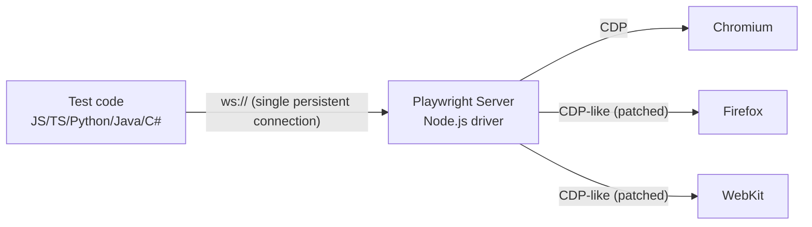
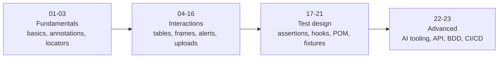
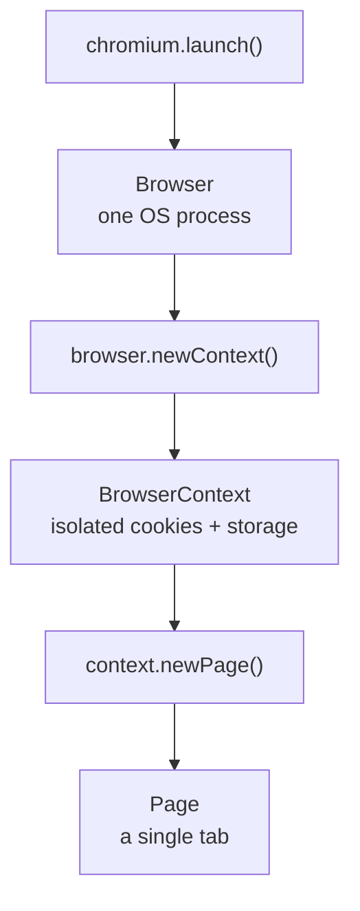

# Learning Playwright Fundamentals 3x

Personal hands-on Playwright + TypeScript practice repo. Test scaffolding, sample specs, and notes as I work through Playwright fundamentals — install Playwright, run the sample tests, record new ones with codegen, and read the HTML report.

> Owner: [Pratik Rajpure](https://github.com/Pratikraj211998)

---

## Playwright architecture

Playwright is a **client-server** tool. Understanding the three tiers explains most of its behaviour:

1. **Client libraries** — your test code. Playwright supports JavaScript/TypeScript natively and ships bindings for Java, Python, C# and (community) PHP. Every binding talks the same wire protocol, so the API is nearly identical across languages.
2. **WebSocket connection (`ws://`)** — the client opens a single, persistent, bidirectional connection to the Playwright server and keeps it open for the whole session. One connection carries every command and every event, which is why Playwright is fast and can stream events (console logs, network, dialogs) back to your test in real time.
3. **Node.js server** — the driver process. It translates your API calls into browser protocol messages, and it runs on Node even when your tests are written in Python or Java.
4. **Browser rendering processes** — the server speaks **CDP** (Chrome DevTools Protocol) to Chromium, and a **patched/extended protocol (CDP+)** to the Playwright builds of Firefox and WebKit. This is why Playwright ships its own browser binaries: the Firefox and WebKit builds carry patches that expose a CDP-like surface.



**Why this matters when you write tests**

| Architecture fact | What you get |
|---|---|
| One persistent WebSocket | Fast execution, no per-command HTTP overhead |
| Server streams events back | Auto-waiting, `page.on('request')`, dialog handling, tracing |
| Server owns the browser | Parallel isolated `BrowserContext`s instead of full browser restarts |
| Patched Firefox/WebKit | Same API across all three engines, hence `npx playwright install` |

---

## 1. Prerequisites

| Tool | Version | Check with |
|------|---------|-----------|
| Node.js | 18 or higher (20+ recommended) | `node -v` |
| npm | comes with Node | `npm -v` |
| VS Code | latest (optional but recommended) | - |
| Git | latest | `git --version` |

Download Node.js from https://nodejs.org (pick the LTS build).

---

## 2. Clone and install

```bash
git clone https://github.com/Pratikraj211998/LearningPlaywrightFundamental3X.git
cd LearningPlaywrightFundamental3X

# install project dependencies (@playwright/test, @types/node)
npm install

# download the browser binaries Playwright drives (Chromium, Firefox, WebKit)
npx playwright install
```

On Linux you may also need the OS libraries:

```bash
npx playwright install --with-deps
```

Only need one browser? `npx playwright install chromium`

---

## 3. Setting up a Playwright project from scratch

This is the exact flow used to bootstrap this repo, if you want to build one yourself:

```bash
mkdir my-playwright-project
cd my-playwright-project

npm init -y
npm init playwright@latest
```

The installer asks a few questions. Answers used in this repo:

| Question | Answer |
|----------|--------|
| TypeScript or JavaScript? | **TypeScript** |
| Where to put your end-to-end tests? | **tests** |
| Add a GitHub Actions workflow? | your choice |
| Install Playwright browsers? | **true** |

It scaffolds:

```
playwright.config.ts     # all Playwright settings
tests/example.spec.ts    # first sample test
package.json             # scripts + devDependencies
.gitignore
```

Manual alternative (what `npm init playwright` does under the hood):

```bash
npm i -D @playwright/test @types/node
npx playwright install
```

---

## 4. Project structure (current)

This is what actually exists in the repo today:

```
LearningPlaywrightFundamental3X/
├── tests/
│   ├── example.spec.ts     # title assertion sample test (playwright.dev)
│   └── tta-check.spec.ts   # codegen'd login flow, TTA practice site
├── playwright.config.ts    # testDir, reporter, trace, headless, projects
├── package.json
├── playwright-report/      # generated HTML report (git ignored)
├── test-results/           # traces, screenshots, videos (git ignored)
└── README.md
```

---

## 5. Curriculum roadmap (planned)

The plan is to grow this repo topic-by-topic as I work through Playwright fundamentals. Everything below **beyond topic 01** is a roadmap, not code that exists yet — folders/files will be added as each topic is actually done, and this table will be updated to match.



| # | Topic | Status | # | Topic | Status |
|---|---|:---:|---|---|:---:|
| 01 | Basics | 🟡 in progress | 13 | Shadow DOM | ⬜ planned |
| 02 | Test Annotations | ⬜ planned | 14 | File Upload | ⬜ planned |
| 03 | Locator Commands | ⬜ planned | 15 | File Download | ⬜ planned |
| 04 | Session Storage | ⬜ planned | 16 | Scroll to Element | ⬜ planned |
| 05 | Allure Reporting | ⬜ planned | 17 | Expect Assertions | ⬜ planned |
| 06 | Multiple Element Filter | ⬜ planned | 18 | Test Hooks | ⬜ planned |
| 07 | WebTables | ⬜ planned | 19 | Data Driven Testing | ⬜ planned |
| 08 | Web Select, Frames, Iframe | ⬜ planned | 20 | Page Object Model | ⬜ planned |
| 09 | Frame / Iframe | ⬜ planned | 21 | Fixture | ⬜ planned |
| 10 | Keyboard, Hover, Drag Drop, Calendar | ⬜ planned | 22 | Misc AI Concepts | ⬜ planned |
| 11 | JS Alerts | ⬜ planned | 23 | Advance PW Framework | ⬜ planned |
| 12 | Handle SVG | ⬜ planned | | | |

When topics 01-03 are actually filled in, the plan is to organize `tests/` into numbered subfolders (`tests/01_Basics/`, `tests/02_TestAnnotations/`, ...) so a file always maps back to the lesson it came from, and `testDir: './tests'` in `playwright.config.ts` will keep discovering specs at any depth without changes.

Topics 22-23 are expected to branch further once reached (API testing, Cucumber BDD, CI/CD with GitHub Actions/Jenkins, AI agent tooling) — details will be filled in here as that work actually starts.

---

## 6. Running the tests

```bash
# run everything
npx playwright test

# run a single file
npx playwright test tests/tta-check.spec.ts

# run one test by title
npx playwright test -g "has title"

# headed mode (watch the browser)
npx playwright test --headed

# UI mode: the best way to learn, time travel + watch mode
npx playwright test --ui

# debug mode with the Playwright Inspector
npx playwright test --debug

# pick a browser project
npx playwright test --project=chromium

# run serially, useful while debugging
npx playwright test --workers=1
```

Open the report after a run:

```bash
npx playwright show-report
```

These npm scripts are already wired up in `package.json`:

```bash
npm test            # playwright test
npm run test:headed # playwright test --headed
npm run test:ui     # playwright test --ui
npm run test:debug  # playwright test --debug
npm run report      # playwright show-report
npm run codegen     # playwright codegen
```

---

## 7. Codegen: record tests automatically

Playwright's codegen tool records your interactions with a page and generates test code for you. It prefers user-facing locators (`getByRole`, `getByLabel`, `getByTestId`) over brittle CSS/XPath.

### Basic recording

```bash
npm run codegen
```

### Record starting at a URL

```bash
npx playwright codegen https://playwright.dev
```

### Save the recording straight into a spec file

```bash
npx playwright codegen --target=playwright-test -o tests/new-test.spec.ts https://playwright.dev
```

### Useful codegen flags

| Flag | What it does |
|------|--------------|
| `-o, --output <file>` | write the generated code to a file |
| `--target=<lang>` | `playwright-test`, `javascript`, `python`, `java`, `csharp` |
| `-b, --browser <name>` | `chromium` (default), `firefox`, `webkit` |
| `--device="iPhone 13"` | emulate a mobile device |
| `--viewport-size=1280,720` | set the window size |
| `--color-scheme=dark` | record in dark mode |
| `--timezone="Asia/Kolkata"` | set the timezone |
| `--geolocation="28.6139,77.2090"` | set coordinates |
| `--save-storage=auth.json` | save cookies + localStorage after login |
| `--load-storage=auth.json` | start already logged in |
| `--ignore-https-errors` | skip certificate warnings |

### Record a logged-in session

```bash
# 1. log in manually, then close the browser. state is saved.
npx playwright codegen --save-storage=playwright/.auth/user.json https://app.thetestingacademy.com/playwright/multiple_element_filter

# 2. reuse that session for the next recording, no login steps needed
npx playwright codegen --load-storage=playwright/.auth/user.json https://app.thetestingacademy.com/playwright/multiple_element_filter
```

### Codegen toolbar

While recording you get a small toolbar with three modes:

- **Record** — captures your actions as code
- **Pick locator** — hover any element and copy its best locator
- **Assert visibility / text / value** — generate `expect()` assertions by clicking

Codegen output is a starting point, not a final test. Clean it up: remove stray `click()` before `fill()`, add assertions, extract repeated steps.

### Explore a locator from a paused test

```ts
await page.pause();
```

`page.pause()` inside a test opens the Inspector so you can step through and explore locators live, without starting a whole new codegen session.

---

## 8. What's inside the sample tests today

**tests/example.spec.ts** — the classic first test, asserts the page title:

```ts
import { test, expect } from '@playwright/test';

test('has title', async ({ page }) => {
  await page.goto('https://playwright.dev/');
  await expect(page).toHaveTitle(/Playwright/);
});
```

**tests/tta-check.spec.ts** — a codegen recording of a login flow against The Testing Academy's Playwright practice site, using `getByRole` and `getByTestId` locators:

```ts
import { test, expect } from '@playwright/test';

test('test', async ({ page }) => {
  await page.goto('https://app.thetestingacademy.com/playwright/multiple_element_filter');
  await page.getByRole('textbox', { name: 'Email Address' }).click();
  await page.getByRole('textbox', { name: 'Email Address' }).fill('pratik');
  await page.getByRole('textbox', { name: 'Password' }).click();
  await page.getByRole('textbox', { name: 'Password' }).fill('Pass@123');
  await page.getByTestId('login-button').click();
});
```

---

## 9. Concepts to cover as the roadmap progresses

These are previews of patterns coming up in later topics — not code that exists in this repo yet.

### Browser → Context → Page

A `Browser` is the launched binary (one heavy OS process), a `BrowserContext` is an isolated incognito-style profile inside it (its own cookies, localStorage, cache), and a `Page` is a single tab inside that context. Restarting a whole browser per test is slow; a fresh `BrowserContext` gives the same clean-slate isolation in milliseconds instead of seconds.



### Multiple contexts at once

One `Browser` can host many `BrowserContext`s at the same time, each with its own session — useful for multi-role flows (admin approves, viewer sees the result) without logging out in between:

```ts
test('two roles at once', async ({ browser }) => {
  const adminContext = await browser.newContext();
  const viewerContext = await browser.newContext();

  const adminPage = await adminContext.newPage();
  const viewerPage = await viewerContext.newPage();

  await adminContext.close();
  await viewerContext.close();
});
```

### Context options

`browser.newContext()` takes an options object that configures the emulated environment — viewport, locale, timezone, geolocation, device — for every page in that context:

```ts
const context = await browser.newContext({
  viewport: { width: 1920, height: 1080 },
  locale: 'fr-FR',
  timezoneId: 'Europe/Paris',
  geolocation: { latitude: 48.8566, longitude: 2.3522 },
  permissions: ['geolocation'], // required or geolocation is silently ignored
});
```

Prefer Playwright's built-in device descriptors over hand-rolled ones:

```ts
import { devices } from '@playwright/test';
const context = await browser.newContext({ ...devices['iPhone 13'] });
```

### Test annotations

Annotations change whether and how a test runs — useful once the suite has broken, unfinished, or known-failing tests:

```ts
test.skip('checkout with PayPal', async ({ page }) => { /* not applicable here */ });
test.fixme('upload 2GB file', async () => { /* known broken, needs a fix */ });
test.fail('cart total is wrong, BUG-451', async () => { /* expected to fail */ });
```

`test.only` silently disables every other test in its file — never commit it; `forbidOnly: !!process.env.CI` in this repo's config already fails CI if one slips in.

---

## 10. playwright.config.ts explained

```ts
export default defineConfig({
  testDir: './tests',              // where specs live
  fullyParallel: true,             // run test files in parallel
  forbidOnly: !!process.env.CI,    // fail CI if test.only is left behind
  retries: process.env.CI ? 2 : 0, // retry flaky tests on CI only
  workers: process.env.CI ? 1 : undefined,
  reporter: 'html',                // HTML report in playwright-report/
  use: {
    trace: 'on-first-retry',       // record a trace when a test retries
    headless: false               // show the browser locally
  },
  projects: [
    { name: 'chromium', use: { ...devices['Desktop Chrome'] } }
  ]
});
```

Add Firefox and WebKit later by extending `projects`:

```ts
projects: [
  { name: 'chromium', use: { ...devices['Desktop Chrome'] } },
  { name: 'firefox',  use: { ...devices['Desktop Firefox'] } },
  { name: 'webkit',   use: { ...devices['Desktop Safari'] } },
]
```

---

## 11. Traces and debugging

```bash
# force a trace for every test
npx playwright test --trace on

# open a saved trace
npx playwright show-trace test-results/<folder>/trace.zip
```

The trace viewer gives a DOM snapshot per action, network calls, console logs, and a timeline — the fastest way to answer "why did this fail on CI".

---

## 12. VS Code extension

Install **Playwright Test for VSCode** (Microsoft). It gives you:

- run/debug a single test from the gutter
- **Record new** and **Record at cursor** buttons (codegen inside the editor)
- **Pick locator** from the Testing sidebar
- breakpoints in TypeScript with live browser stepping

---

## 13. Locator cheat sheet

```ts
page.getByRole('button', { name: 'Submit' })   // preferred, accessibility based
page.getByText('Welcome back')
page.getByLabel('Email Address')
page.getByPlaceholder('Enter your email')
page.getByTestId('login-button')               // needs data-testid
page.getByTitle('Close')
page.getByAltText('Company logo')

page.locator('.card').filter({ hasText: 'Pro' })
page.locator('li').nth(2)
page.locator('table tr').first()
```

Order of preference: role → label → placeholder → text → testid → CSS/XPath.

---

## 14. Common assertions

```ts
await expect(page).toHaveTitle(/Playwright/);
await expect(page).toHaveURL('https://example.com/dashboard');
await expect(locator).toBeVisible();
await expect(locator).toHaveText('Logged in');
await expect(locator).toContainText('Welcome');
await expect(locator).toHaveValue('pratik');
await expect(locator).toBeEnabled();
await expect(locator).toHaveCount(5);
```

All `expect` calls auto-wait, so `waitForTimeout` is rarely needed.

---

## 15. Troubleshooting

| Problem | Fix |
|---------|-----|
| `Executable doesn't exist` | run `npx playwright install` |
| Browser closes instantly | that is normal in headless mode, use `--headed` or `--debug` |
| `test.only` blocked on CI | remove `.only`, `forbidOnly` is on |
| Test flaky on CI, fine locally | run `--trace on`, open the trace, look at the failing action |
| Codegen picks ugly CSS locators | add `data-testid` attributes to the app |
| Port/proxy issues on a corporate network | `HTTPS_PROXY=... npx playwright install` |

---

## 16. Useful links

- Playwright docs: https://playwright.dev/docs/intro
- Codegen guide: https://playwright.dev/docs/codegen
- Locators: https://playwright.dev/docs/locators
- Trace viewer: https://playwright.dev/docs/trace-viewer
- Practice site used in tests/tta-check.spec.ts: https://app.thetestingacademy.com/playwright/

---

## License

MIT
