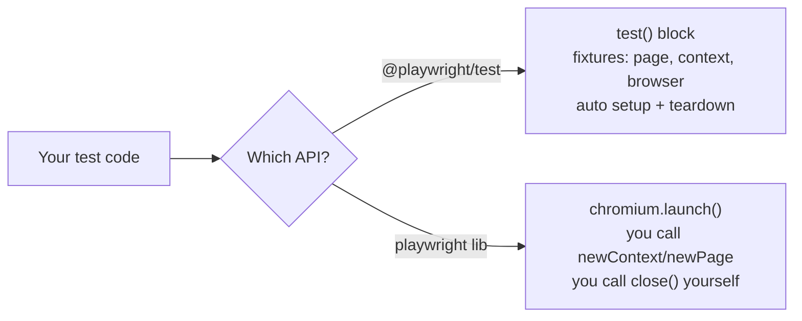
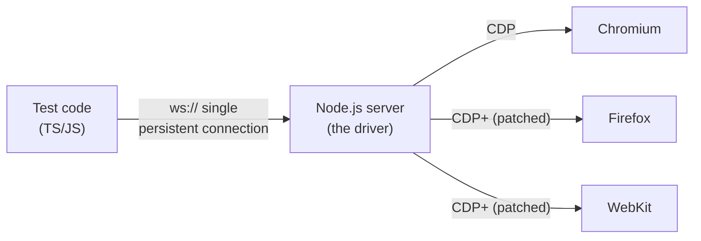
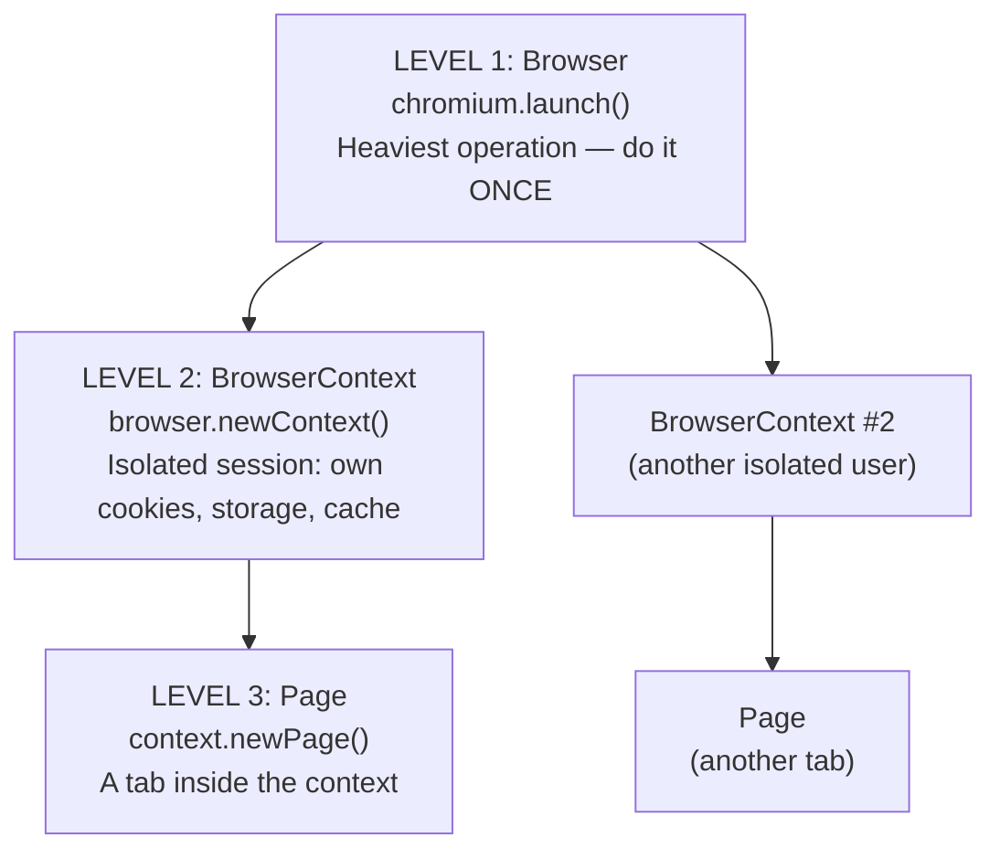
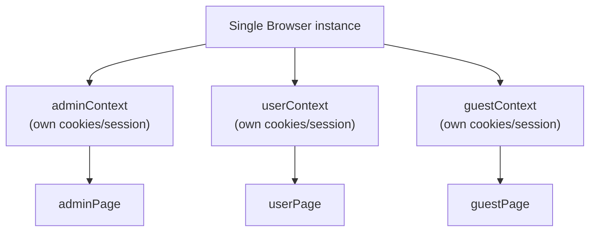
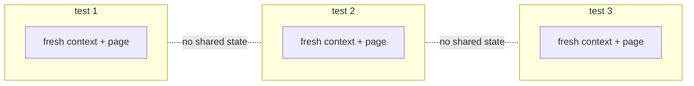
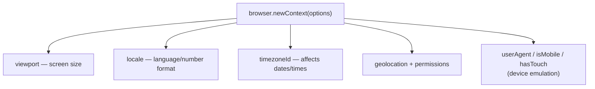
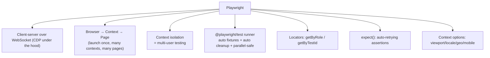

# 01_Basics — Notes

Notes for everything covered in `tests/01_Basics/`. Diagrams are in Mermaid
(renders natively on GitHub and in VS Code's Markdown preview).

## File map

| File | Concept it teaches |
|---|---|
| `216_example.spec.ts` | Playwright Test basics: `test()`, `page.goto`, locators, `expect` |
| `217_Multiple_Context.ts` | Multiple `BrowserContext`s = multiple isolated users (raw `playwright` lib) |
| `218_Normal_Playwright.ts` | Browser → Context → Page hierarchy, manual launch/cleanup (raw lib) |
| `219_tta-check.spec.ts` | Real-world login flow using role-based locators |
| `220_BCP.spec.ts` | Browser-Context-Page pattern explained level by level |
| `221_TA.spec.ts` | Independent tests per file + multi-role test (admin/user/guest) |
| `222.Test_Options.spec.ts` | Context options: viewport, locale, geolocation, mobile emulation |

---

## 1. Two ways to write Playwright code

Playwright has two different "entry points" you'll see across these files:

1. **Playwright Test runner** (`import { test, expect } from '@playwright/test'`)
   Used in: `216`, `219`, `220`, `221`, `222`.
   The test runner gives you a ready-made `page`/`context`/`browser` as **fixtures** —
   you never call `chromium.launch()` yourself.

2. **Raw `playwright` library** (`import { chromium } from "playwright"`)
   Used in: `217`, `218`.
   You manage the whole lifecycle by hand: launch browser → create context → open page → close everything.



**Why it matters:** the Test runner (option 1) is what you'll use for actual test suites —
it auto-creates a fresh context per test and cleans up for you. The raw library (option 2)
is useful for scripts/automation outside of a test suite, or to understand what the
Test runner is doing under the hood.

---

## 2. Playwright's architecture (client-server)

Every API call you write (`page.click()`, `page.goto()`, etc.) does not talk to the
browser directly — it goes through a persistent WebSocket connection to a Node.js
server, which drives the browser via CDP (Chrome DevTools Protocol).



**Takeaway:** one connection carries every command and every event (console logs,
network, dialogs) back to your test in real time — this is why Playwright auto-waits
and feels fast compared to tools that fire a new request per command.

---

## 3. The Browser → Context → Page hierarchy (BCP)

This is the single most important mental model in Playwright. Three levels, each
nested inside the previous one:



- **Browser** — the actual browser process. Expensive to start, so launch it once and
  reuse it.
- **BrowserContext** — think of it as an "incognito profile." Each context has its own
  cookies, local storage, cache, and permissions. Contexts under the same browser do
  **not** share login state.
- **Page** — a single tab inside a context. A context can have multiple pages/tabs.

Seen in `218_Normal_Playwright.ts`:

```ts
let browser: Browser = await chromium.launch({ headless: false });
let context: BrowserContext = await browser.newContext();
let page = await context.newPage();

await page.goto("https://example.com");

// Cleanup — ALWAYS in reverse order
await page.close();
await context.close();
await browser.close();
```

**Cleanup rule:** close in the reverse order you opened — `page → context → browser`.
Closing a browser without closing its contexts/pages first can leave resources dangling.

---

## 4. Multiple contexts = multiple isolated users

Because each `BrowserContext` is isolated, this is the standard way to simulate
**two or more logged-in users at the same time** in one browser instance — no need
to launch separate browsers.



From `217_Multiple_Context.ts` (raw library):

```ts
let browser = await chromium.launch({ headless: false });

let adminContext = await browser.newContext();
let adminPage = await adminContext.newPage();
await adminPage.goto("https://app.vwo.com/login");

let viewerContext = await browser.newContext();
let viewerPage = await viewerContext.newPage();
await viewerPage.goto("https://app.vwo.com/login");

await adminContext.close();
await viewerContext.close();
await browser.close();
```

Same idea, but inside the **Test runner** using the `browser` fixture directly
(`220_BCP.spec.ts` / `221_TA.spec.ts`):

```ts
test("BCP - in app.vwo.com two roles", async ({ browser }) => {
  let adminContext = await browser.newContext();
  let userContext  = await browser.newContext();
  let guestContext = await browser.newContext();

  let adminPage = await adminContext.newPage();
  await adminPage.goto("https://app.thetestingacademy.com/playwright/");

  let userPage = await userContext.newPage();
  await userPage.goto("https://sdet.live");

  let guestPage = await guestContext.newPage();
  await guestPage.goto("https://scrolltest.com");

  await adminPage.close();
  await userPage.close();
  await guestPage.close();
});
```

**Why this is useful:** role-based testing (admin vs. viewer vs. guest), or any
scenario where two users need to interact in the same test (e.g. chat, approvals,
multi-party workflows) — without the overhead of launching multiple browsers.

---

## 5. Test isolation inside the Test runner

A detail that's easy to miss: when you use `@playwright/test`'s `test()` function,
**every single test gets its own fresh `page`/`context` automatically** — you don't
see `newContext()`/`newPage()` calls because the runner does it for you before each
test and tears it down after.

Seen in `221_TA.spec.ts` — three independent `test()` blocks, each navigating to a
different site, with zero shared state between them:

```ts
test("Navigating to the tta website", async ({ page }) => {
  await page.goto("https://app.thetestingacademy.com/playwright/");
});

test("Navigating to the sdet.live website", async ({ page }) => {
  await page.goto("https://sdet.live");
});

test("navigate to scroltest.com", async ({ page }) => {
  await page.goto("https://scrolltest.com");
});
```



**Takeaway:** this is why Playwright tests are safe to run in parallel — one test's
cookies/login/localStorage can never leak into another.

---

## 6. Locators and actions

From `216_example.spec.ts` and `219_tta-check.spec.ts` — how to find elements and
interact with them. Prefer **role-based locators** (`getByRole`) over CSS selectors
where possible — they match how real users/assistive tech perceive the page.

```ts
// Find by ARIA role + accessible name
await page.getByRole('link', { name: 'Get started' }).click();
await page.getByRole('textbox', { name: 'Enter email or username' }).fill('user@example.com');
await page.getByRole('button', { name: 'SIGN IN' }).click();

// Find by a custom test id (data-testid attribute)
await page.getByTestId('login-button').click();
```

A full login flow (`219_tta-check.spec.ts`):

```ts
test('test', async ({ page }) => {
  await page.goto('https://app.fairplay-mobile.com/');
  await page.getByRole('button', { name: 'ACCEPT' }).click();
  await page.getByRole('button', { name: 'LOGIN' }).click();
  await page.getByRole('textbox', { name: 'Enter email or username' }).click();
  await page.getByRole('textbox', { name: 'Enter email or username' }).fill('Pradeep.Sahoo@tecnotree.com');
  await page.getByRole('textbox', { name: 'Enter your password' }).click();
  await page.getByRole('textbox', { name: 'Enter your password' }).fill('Test@007');
  await page.getByRole('button', { name: 'SIGN IN' }).click();
});
```

---

## 7. Assertions (`expect`)

From `216_example.spec.ts`:

```ts
// Page-level assertion — title contains a substring/regex
await expect(page).toHaveTitle(/Playwright/);

// Locator assertion — element is visible on screen
await expect(page.getByRole('heading', { name: 'Installation' })).toBeVisible();
```

`expect` assertions **auto-retry** until the condition is true or the timeout is hit —
you don't need manual `waitForTimeout()`/sleeps for most cases (notice the commented-out
`page.waitForTimeout(50000)` lines in `219` — that's the anti-pattern being avoided).

---

## 8. Context options — customizing the environment

A `BrowserContext` can be configured at creation time to simulate different devices,
locations, and permissions. Seen in `222.Test_Options.spec.ts`:

```ts
const context = await browser.newContext({
  viewport: { width: 1920, height: 1080 },   // screen size
  locale: 'fr-FR',                            // browser language
  timezoneId: 'Europe/Paris',                 // system timezone
  geolocation: { latitude: 48.8566, longitude: 2.3522 }, // GPS coords
  permissions: ['geolocation'],               // grant permission up front
});
```

### Mobile device emulation

Instead of listing options manually, you can build (or import from
`playwright.devices`) a device descriptor and spread it into `newContext()`:

```ts
const iPhone = {
  viewport: { width: 375, height: 667 },
  userAgent: 'Mozilla/5.0 (iPhone; CPU iPhone OS 14_0 like Mac OS X)',
  deviceScaleFactor: 2,
  isMobile: true,
  hasTouch: true,
};
const context = await browser.newContext(iPhone);
```



**Why it matters:** this is how you test responsive layouts, geo-restricted features,
or mobile-only UI — all without a real device, by configuring the context once before
creating the page.

---

## Quick recap



| Concept | One-line rule of thumb |
|---|---|
| Browser | Launch once, it's expensive |
| Context | One per isolated session/user — own cookies |
| Page | One tab inside a context |
| Cleanup order | `page.close() → context.close() → browser.close()` |
| Test runner fixtures | Free fresh `page`/`context` per test, no manual setup |
| Locators | Prefer `getByRole` / `getByTestId` over raw CSS |
| Assertions | `expect(...)` auto-waits — avoid `waitForTimeout` |
| Context options | Configure once in `newContext()`, applies to every page in it |
