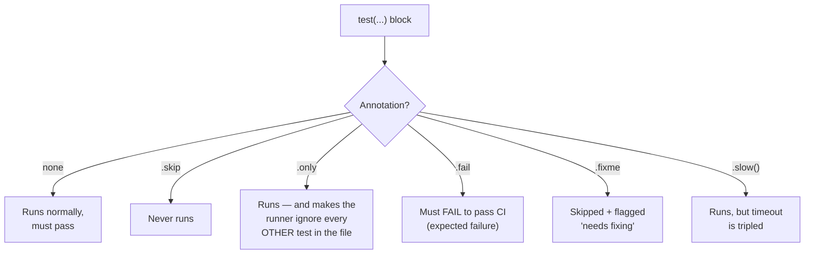
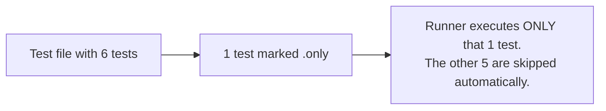
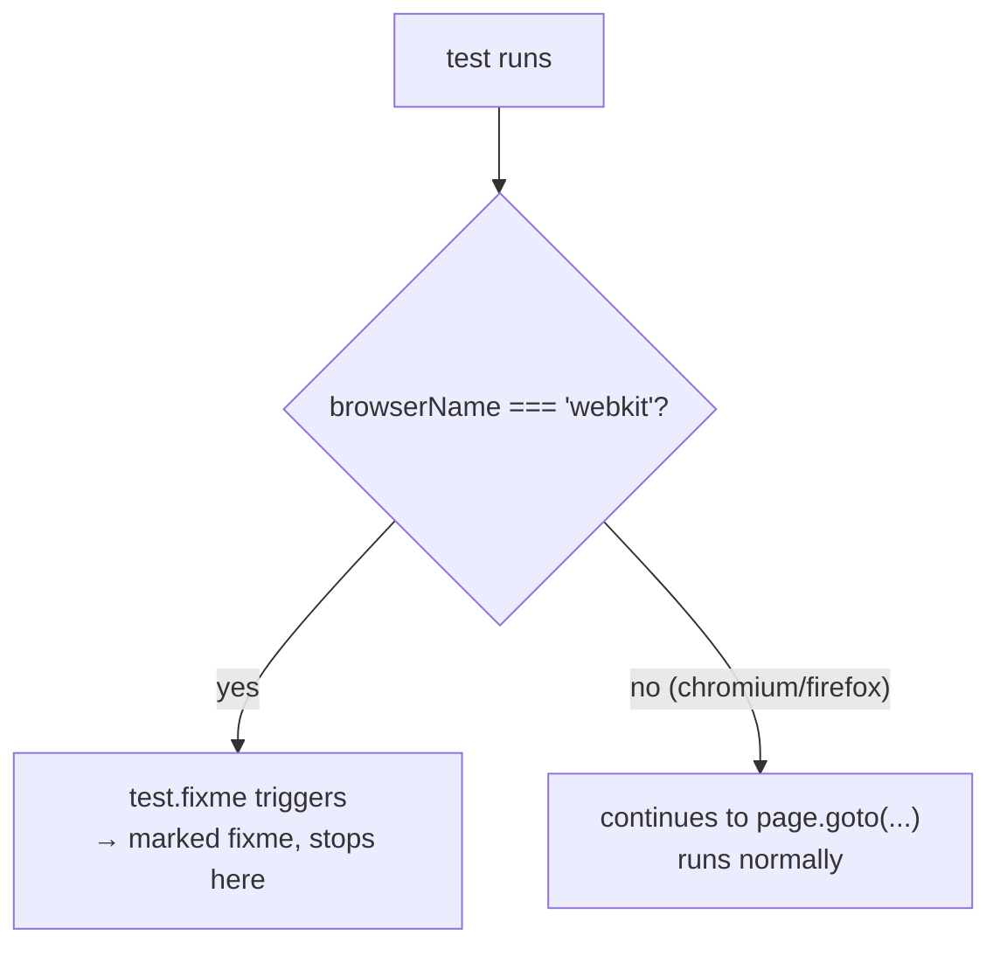
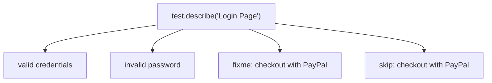
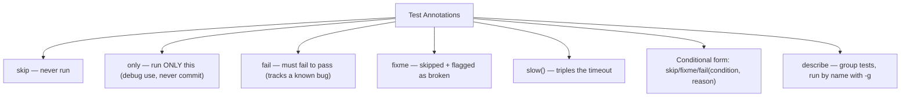

# 02_TestAnnotations — Notes

Notes for everything covered in `tests/02_TestAnnotations/`. Diagrams are in Mermaid
(renders natively on GitHub and in VS Code's Markdown preview).

## File map

| File | Concept it teaches |
|---|---|
| `223_TestAnnotations.spec.ts` | Test annotations: `skip`, `only`, `fail`, `fixme`, `slow`, conditional modifiers |
| `224_TestDescribe.spec.ts` | Grouping tests with `test.describe`, running a group by name with `-g` |

---

## 1. What are "annotations"?

Annotations are flags you attach to a `test()` (or a whole file/group) that tell the
Playwright **runner** how to treat that test, without you writing any `if` logic
yourself. They show up clearly in the HTML report too (skipped, expected-to-fail, etc.).



---

## 2. `test.skip` — never run this test

From `223_TestAnnotations.spec.ts`:

```ts
test.skip('checkout with PayPal', async ({ page }) => {
  // never executes
});
```

Use for a test that's temporarily irrelevant (feature not built yet, flaky and
under investigation, etc.). It still shows up in the report as **skipped**, not
silently deleted — so nobody forgets it exists.

---

## 3. `test.only` — run ONLY this test

```ts
test.only('login as Pramod', async ({ page }) => {
  // only this test runs, everything else in the file is ignored
});
```



**Danger:** this is meant for local debugging only — "I just want to focus on this
one test right now." **Never commit `test.only`** — it will silently skip the rest
of your suite in CI. Many teams add a lint rule to block it from merging.

---

## 4. `test.fail` — this test is EXPECTED to fail

```ts
test.fail('cart total is wrong, BUG-451', async () => {
  expect(90).toBe(100);   // actually returns 90
});
```

Normally an `expect` mismatch fails the run. `test.fail` flips that: the test
**must fail internally** for the overall run to count as passing. If someone
fixes `BUG-451` and the assertion starts passing, this test now **fails the
suite** (because it stopped failing!) — forcing you to come back and remove the
`.fail` tag. It's a way to document a known bug with a live, self-expiring pointer
instead of a comment.

---

## 5. `test.fixme` — skip it, but flag it as broken

```ts
test.fixme('upload 2GB file', async () => {
  // skipped, but flagged as "needs fixing"
});
```

Very similar to `.skip`, but semantically says "this is broken/not-ready, someone
needs to come back and fix it" rather than "this is intentionally excluded."

### Conditional `fixme` — skip only for specific conditions

```ts
test('mobile layout', async ({ page, browserName }) => {
  test.fixme(browserName === 'webkit', 'Safari renders menu wrong');

  await page.goto("https://sdet.live");
});
```

Here `test.fixme(condition, reason)` is called **inside** the test body. The test
still runs for Chromium/Firefox, but is skipped specifically on WebKit, with a
documented reason. This pattern (condition + reason) also works with `test.skip(...)`
and `test.fail(...)`.



---

## 6. `test.slow()` — give this test more time

```ts
test('full regression report', async () => {
  test.slow();
  console.log(test.info().timeout);   // 90000 instead of 30000
});
```

Calling `test.slow()` inside a test triples its timeout (e.g. default 30000ms →
90000ms). Use it for tests you know are inherently heavier (large reports, big
file uploads, long flows) instead of hard-coding a custom timeout everywhere.

`test.info()` gives you the current test's metadata (timeout, title, status, etc.)
— handy for logging/debugging.

---

## 7. `test.describe` — grouping related tests

From `224_TestDescribe.spec.ts`:

```ts
test.describe('Login Page', () => {

    test('valid credentials', async ({ page }) => {
        await page.goto("https://app.thetestingacademy.com/playwright/");
    });

    test('invalid password', async ({ page }) => {
        await page.goto("https://app.thetestingacademy.com/playwright/");
    });

    test.fixme('1checkout with PayPal', async ({ page }) => {
        // never executes
    });

    test.skip('checkout with PayPal', async ({ page }) => {
        // never executes
    });
});
```



`describe` doesn't change how tests run (each still gets its own isolated
page/context) — it's purely organizational: groups related tests under one
named block for the report, and lets you target that whole group from the CLI.

### Running just one group by name

```bash
npx playwright test -g "Login Page"
```

`-g` (`--grep`) filters tests/describe-blocks whose title matches the given
pattern — so you can run a single feature's tests without running the whole
suite.

---

## Quick recap



| Annotation | Runs? | Must pass? | Typical use |
|---|---|---|---|
| (none) | Yes | Yes | Normal test |
| `test.skip` | No | — | Not relevant right now |
| `test.only` | Only this one | Yes | Local debugging only — never commit |
| `test.fail` | Yes | Must **fail** | Document a known/open bug |
| `test.fixme` | No | — | Broken, needs a fix, tracked explicitly |
| `test.slow()` | Yes | Yes | Inherently long test, needs more timeout |
| `test.describe` | n/a | n/a | Group + organize + target with `-g` |
